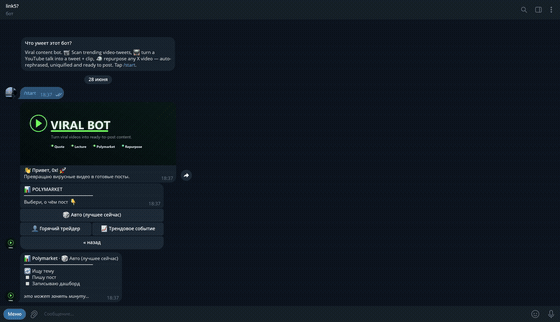
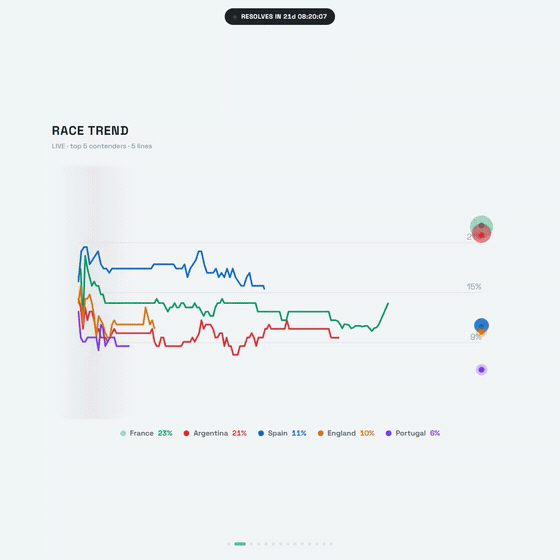

# marketcast


[](https://github.com/sixsechszes-666/marketcast/actions/workflows/ci.yml)


> Turn live **Polymarket** prediction-market data into AI-written viral **X (Twitter)** posts - with a matching 1:1 dashboard **video** rendered automatically.

<p align="center">
  <br/>
  <em>One command: live Polymarket data → a fact-grounded, publish-ready X post <b>and</b> a matching 1:1 dashboard video, rendered automatically.</em>
</p>

marketcast watches what's hyped on Polymarket (trending events and the traders making outsized PnL), writes a publish-ready viral post about it in a tuned house voice, and records a square dashboard video about the *same* subject so the text and the clip ship together.

It's a compact, end-to-end content-automation pipeline: a self-contained X API client, a resilient multi-provider LLM layer, a data/research layer, a generation layer, and a Node + Playwright + ffmpeg video recorder - wired behind one CLI.

---

## Why this project

This is a portfolio rewrite of a real, working content bot, restructured into clean architecture to show:

- **API reverse-engineering** - `xclient`, a from-scratch X/Twitter read+write client over the private GraphQL/REST API, with self-healing query-ids and TLS impersonation.
- **Grounded generation (anti-hallucination)** - the model writes **only from verified facts** pulled from the source market data. Numbers are checked against the data, not invented - the guardrail that makes automated finance/research content trustworthy.
- **Resilient LLM integration** - a multi-provider layer with a keyless primary (duck.ai) and an automatic API fallback (Kimi/NVIDIA), built to degrade gracefully.
- **Real data pipelines** - live market data → scoring/ranking → research → prompt construction.
- **Cross-language orchestration** - Python pipeline driving a Node/Playwright/ffmpeg renderer.
- **Pragmatic engineering** - env-driven config, typed interfaces, graceful degradation when secrets are absent, and tests around the pure logic.

---

## Sample output

A real post the pipeline generated for the live **World Cup Winner** market (breakdown voice):

> **CAPE VERDE JUST ADVANCED, BUT FRANCE AND ARGENTINA ARE STILL BATTLING FOR 23%**
>
> cape verde shocked everyone by making the group stage with just 1% odds
>
> but the real money is still locked on europe, not the underdogs
>
> france sits at 23% to win it all, argentina right behind at 21%
>
> only 2.1 points separate them after all the chaos so far
>
> \> 83.7 million dollars flowed through the world cup winner market in just 24 hours
> \> 1,928 people are arguing in the comments about who actually has the edge
>
> the whole tournament resolves in about 21 days
>
> the market keeps ignoring the upsets happening on the pitch

Every figure above (odds, volume, comment count, days-to-resolve) is pulled from live market data and grounded, not invented. Every run produces a fresh post; the terse house voice is the default, long-form via `--style breakdown`.

<p align="center">
  <br/>
  <em>…and the matching 1:1 dashboard video the pipeline rendered for <b>this exact</b> post.</em>
</p>

---

## Architecture

```
                         ┌──────────────────────────────────────────┐
   Polymarket API ─────▶ │  markets/   pick_subject · research       │
                         │     polymarket.py · research.py · models  │
                         └───────────────┬──────────────────────────┘
                                         │  Subject {kind, hype, facts}
                                         ▼
   X / Twitter ◀──────── ┌──────────────────────────────────────────┐
   (templates,           │  generation/  generate_post · templates   │ ───▶ post text
    research)            │     dashboard_copy · history              │ ───▶ dashboard copy
                         └───────────────┬──────────────────────────┘
                                         │ calls
                          ┌──────────────▼─────────────┐
                          │  llm/  call_llm             │  duck.ai (primary)
                          │     provider · identities   │  → Kimi/NVIDIA (fallback)
                          └────────────────────────────┘
                                         │  subject + AI copy
                                         ▼
                         ┌──────────────────────────────────────────┐
   Chrome (Playwright) ◀ │  recorder/ (Node)  record.js + dashboards │ ───▶ videos/*.mp4
   + ffmpeg              │     EventDashboard · TraderDashboard …    │
                         └──────────────────────────────────────────┘

                         cli.py ── orchestrates the whole flow
                         config.py ── one env-driven settings singleton
```

```
marketcast/
├── src/marketcast/
│   ├── config.py          # env-driven settings singleton
│   ├── cli.py             # `marketcast post …` end-to-end orchestration
│   ├── xclient/           # X/Twitter API client (read + write)
│   ├── llm/               # LLM provider: duck.ai primary + Kimi fallback
│   ├── markets/           # Polymarket data, subject picking, X research
│   └── generation/        # post generation, templates, dashboard copy, history
├── recorder/              # Node + Playwright + ffmpeg dashboard recorder
│   ├── record.js
│   └── dashboards/*.html
├── tests/                 # offline tests for the pure logic
└── docs/ARCHITECTURE.md   # module contracts
```

---

## Quickstart

### Requirements
- Python 3.10+
- Node.js 18+ and **ffmpeg** on `PATH` (only for the `--video` step)

### Install
```bash
git clone <repo> marketcast && cd marketcast
python -m pip install -e ".[dev,dotenv]"

# for the video recorder
cd recorder && npm install && npx playwright install chromium && cd ..
```

### Configure
```bash
cp .env.example .env
# edit .env - everything is optional:
#   AUTH_TOKEN   → enables live X research + reference-tweet templates
#   NVIDIA_KEYS_FILE → enables the Kimi fallback (duck.ai works keyless)
```
The Polymarket data layer runs with **no secrets at all**; X and LLM features degrade gracefully when their credentials are missing.

### Run
```bash
marketcast post                    # auto-pick a subject, print the post
marketcast post --mode trader      # force a "trader on a heater" story
marketcast post --style breakdown  # long-form analytical voice
marketcast post --video --grid     # also render the grid-style 1:1 video
marketcast post --json             # machine-readable output
marketcast post --out post.txt     # save the post text
```

Run `marketcast post --help` for every flag.

---

## How it works

1. **Pick a subject** (`markets.pick_subject`) - pulls trending Polymarket events and the top holders/PnL traders, scores each for "hype", diversifies, and (optionally) lets the LLM choose the most postable one. Returns a `Subject` = `{kind, hype, facts}`.
2. **Gather context** - `generation.fetch_templates` pulls real reference tweets from X to mirror structure; `markets.research_subject` pulls fresh topical chatter and distills it into bullets + quotes.
3. **Write the post** (`generation.generate_post`) - builds a tuned prompt from the facts + templates + research and calls the LLM, in either the terse house voice or a long-form breakdown. The model is grounded on the verified facts so figures come from the data, not the model's imagination.
4. **Render the video** (optional) - `generation.generate_dashboard_copy` writes the on-screen hook/verdict/analysis, then the Node recorder loads the matching dashboard in headless Chrome, plays the deck, and encodes a clean 1:1 MP4 (capture fingerprints stripped, optional music muxed).

---

## The X client (`xclient`)

A highlight worth reading on its own - see [`src/marketcast/xclient/README.md`](src/marketcast/xclient/README.md). A self-contained x.com client (auth = one cookie, no API keys) over the private GraphQL/REST API, with:
- read (timelines, search, users, followers, threads) + write (tweet, reply, like, follow, lists, DM, media),
- **self-healing query-ids** (scrapes & caches X's rotating GraphQL ids),
- typed errors, session caching, action pacing, and multi-account pooling.

---

## Development

```bash
pytest -q                 # offline test suite (no network) — 63 tests
ruff check src tests      # lint config included
mypy src                  # type-check config included
```

CI runs the test suite on every push (see the badge above).

## Notes & ethics

Built for educational/portfolio use. It automates content creation around public
prediction-market data. Respect X's and Polymarket's terms of service and rate
limits when running it against live accounts. No credentials are bundled.

## License

MIT
